# Messagery

Application de messagerie interne client-serveur en Visual Basic pour le cours de Développement d'Application en Visual Basic.

## Lancer l'application

1. Générez les certificats HTTPS du serveur en naviguant dans `serveur/` et exécutant `générer_certificats.sh`
2. Changez le nom du ficher `.env.example` à `.env` et modifiez-y les valeurs importantes à votre goût.
3. Démarrez le serveur avec la commande `docker compose up -d --build`
4. Ouvrez la solution qui se trouve dans `client/` dans Visual Studio et démarrez l'application.

Vous pouvez modifier les paramètres du serveur en modifiant le fichier `.env` et les données initiales dans le fichier `serveur/init_sql/init_donnees.sql`.

Vous pouvez vous connecter sur l'un des trois comptes présents dans la base de donnée : 

| Nom d'affichage    | Identifiant            | Mot de passe |
|:------------------:|:----------------------:|:------------:|
| Jean Dufour        | `jed02@localhost:8000` | *mdp_jed02*  |
| Marc-André Roubiot | `mar06@localhost:8000` | *mdp_mar06*  |
| Paul Martin        | `pam03@localhost:8000` | *mdp_pam03*  |

Les identifiants sont composés du nom d'identifiant (`nom_id`) et du serveur sur lequel se trouve le compte (`serveur`, ce qui fait `<nom_id>@<serveur>`). Si vous n'avez pas touché à la configuration, ce serveur se trouvera à `localhost:8000`.

## Vision

Messagery est une application de communication texte à des fins d'entreprises. À cette fin, il était nécessaire de faire appel à des technologies et des protocoles robustes ainsi que d'une flexibilité de déploiement qui accomode tous les types de personnels. Ainsi, il est possible de déployer un serveur en quelques clics, d'installer un client instantanément et de permettre à plusieurs serveurs de communiquer entre eux.

## Technologies utilisées

- **Visual Basic.NET 8.0** Pour le client
- **Python 3.10+** Pour le serveur
  - Nous jugions qu'il était plus approprié de prendre un langage de programmation adapté pour des tâches dites « headless » comme un serveur plutôt que d'utiliser VB. Nous avons originalement penché vers python car nous croyions pouvoir nous en sortir avec un serveur bien plus petit qu'il ne l'est actuellement. Sa pertinence serat rediscutée dans la section *discussion*.
- **Microsoft SQL Serveur 2025** Pour la base de donnée
- **Docker et Docker Compose** Pour la conteneurisation et le déploiement en un clic
- **Nginx** Pour gérer le traffique HTTPS
- **Le protocole HTTP** pour la communication en général
- **Le JSON** pour le transfèrt de donnée, au vu de sa flexibilité et de son interopérabilité

## Maquette

Nous avions prévus les maquettes suivantes pour convevoir l'application : 

### Page de connection

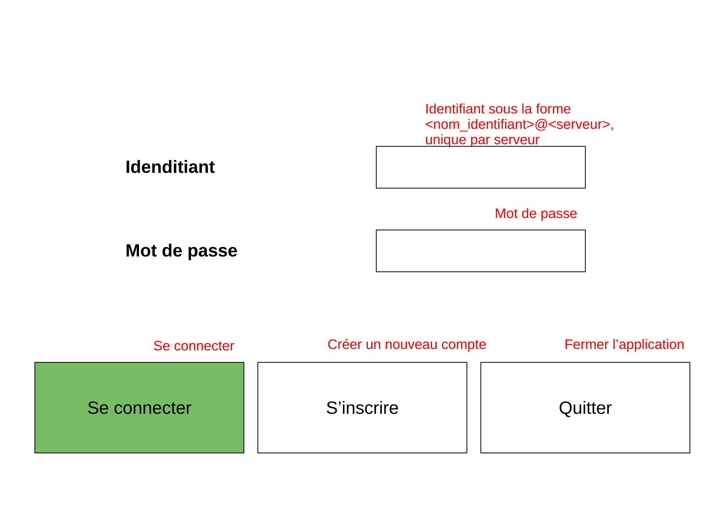

### Page d'inscription

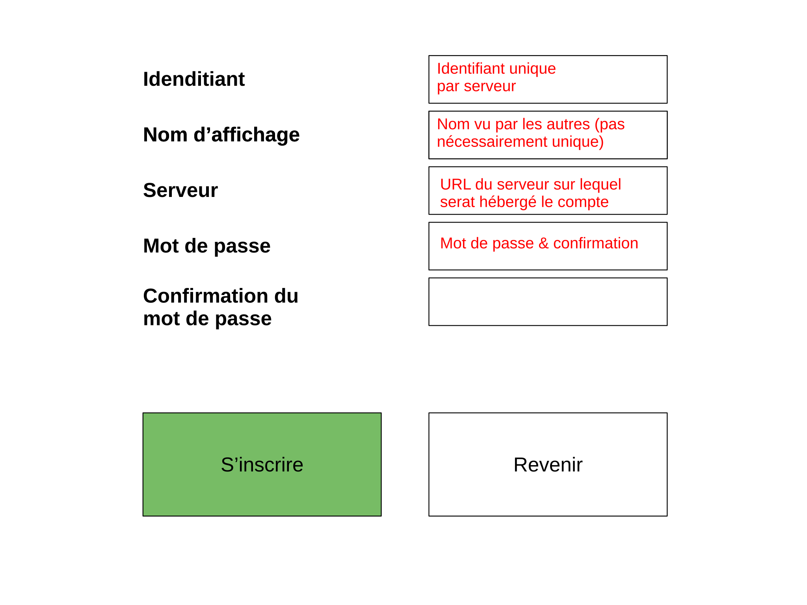

### Page de messagerie

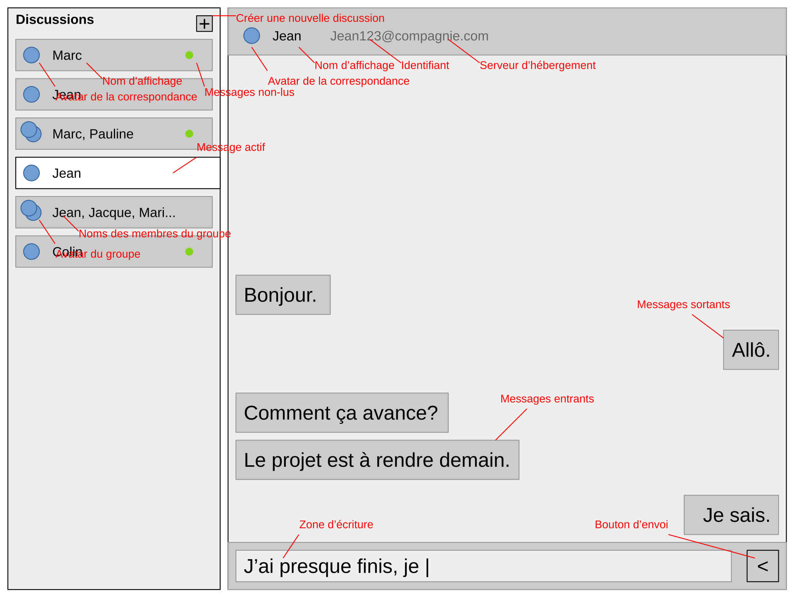

### Page de création de conversation

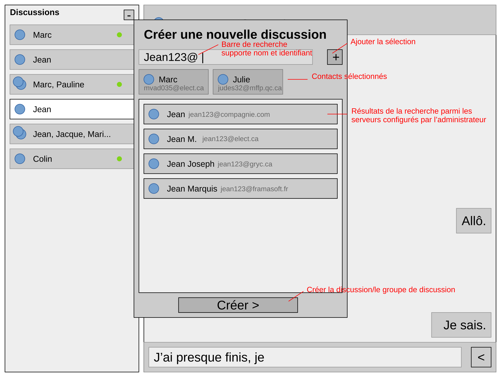

Et voici le résultat final :

### Page de connection

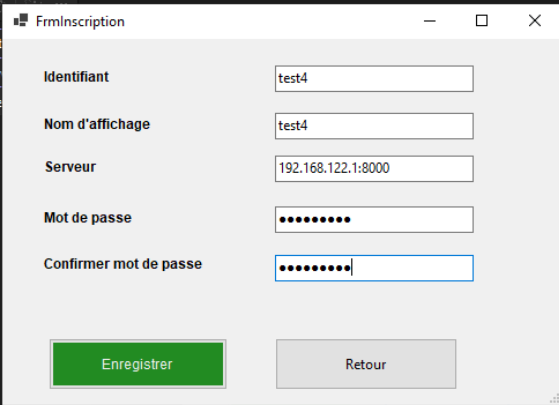

### Page d'inscription

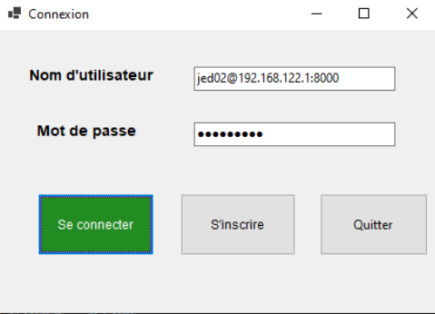

### Page de messagerie

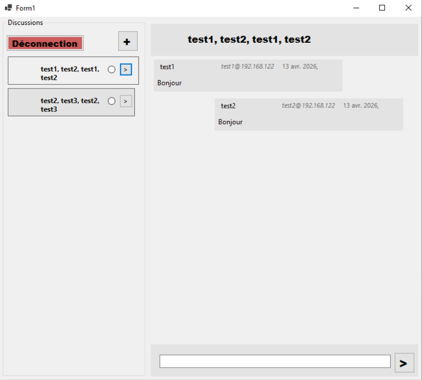

### Page de création de conversation

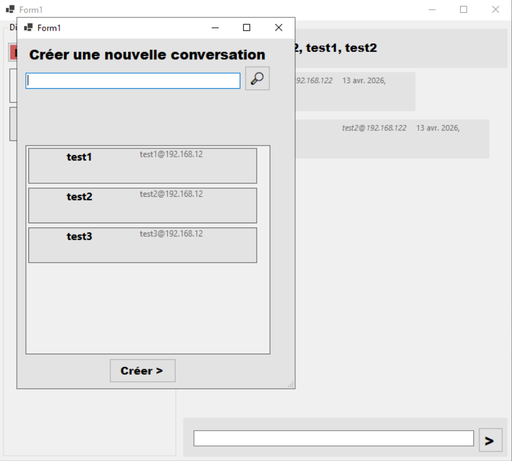

## Fonctionnalités

- Créer et se connecter à un compte stocké sur un serveur
- Créer une ou plusieurs discussions à un ou plusieurs contacts sur un ou plusieurs serveurs
- Rechercher des contacts sur les serveurs configurés par l'administrateur
- Sélectionner une discussion parmis celles créées
- Voir le fil de discussion
- Envoyer et recevoir des messages

## Architecture

### Utilisation et réseau


1. Un administrateur met en place l'infrastructure
2. L'utilisateur démarre son application
3. L'application se connecte au serveur fait une série de synchronisations automatiques
4. L'application, à la demande de l'utilisateur, envoie un message au serveur
5. Le serveur met à jour la base de donnée pour toutes les actions de l'utilisateur
6. Le serveur retransmets les messages obtenus aux contacts interessés.

### Architecture de l'aplication

```text
                          Messages
  Fenêtre     /--Contact ╱    EnTête
 ╱  Discussions   BtnAjouter ╱    MessagesContact
┏━━╱━━━━━━━╱━━━━━╱━━━━╱━━━━━╱━━━━╱━━━━━━━━━━━━━━┓
┃┌╱───────╱─────╱─┐ ╒╱═════╱════╱═════════════╤╕┃
┃| Discus╱ions [+]| || O Nom id@serveur.tld   ||┃
┃|      ╱         | |└────────╱───────────────┘|┃
┃| [o Nom     o ] | |[Message]                /---- MessagesEnvoyés
┃| [o Nom       ] | |[Message]               ╱ |┃
┃| [o Nom     o ] | |                 [Message]|┃
┃| [o Nom        ]| |[Message]                 |┃
┃| [o Nom       ] | |┌────────────────────────┐|┃
┃|                | ||[Message_txt________][>]||┃
┃└────────────────┘ ╘╧╲════════════════════╲═╲╧╛┃
┗━━━━━━━━━━━━━━━━━━━━━━╲━━━━━━━━━━━━━━━━━━━━╲━╲━┛
                        ╲                    ╲ \-- BtnEnvoyer
                         \-- BasDePage        \-- BoiteTexte

                   
                  ConteneurContacts
┏━━━━━━━━━━━━━━━━╱━━━━━━━━━━━━━━━━━━━━━━━━━━━━━━┓
┃┌──────────────╱─┐ ╒╤════════════════════════╤╕┃
┃| Discussions ╱+]| || O Nom id@serveur.tld   ||┃
┃|+--------------+| |└────────────────────────┘|┃
┃||[o Nom     o ]|| |[Message]----------------+|┃
┃||[o Nom       ]|| |[Message]                |---- ConteneurMessages
┃||[o Nom     o ]|| ||                [Message]|┃
┃||[o Nom        ]| |[Message]----------------+|┃
┃||[o Nom       ]|| |┌────────────────────────┐|┃
┃|+--------------+| ||[Message_txt________][>]||┃
┃└────────────────┘ ╘╧════════════════════════╧╛┃
┗━━━━━━━━━━━━━━━━━━━━━━━━━━━━━━━━━━━━━━━━━━━━━━━┛

                             MenuContextuel
                            ╱ Titre
                           ╱ ╱  BoiteRecherche
                          ╱ ╱  ╱          BtnAjouter
   ┏━━━━━━━━━━━━━━━━━━━━━╱━╱━━╱━━━━━━━━━━╱━━━━━━━━━┓
   ┃┌────────────────┐ ╒╱═╱══╱══════════╱════════╤╕┃
   ┃| Discussions [-]| ╱|╱O ╱om id@serv╱ur.tld   ||┃
   ┃|                ┏━━╱━━╱━━━━━━━━━━╱──────────┘|┃
   ┃| [o Nom     o ] ┃ Cré╱r nvl. dis╱┃▒          |┃
   ┃| [o Nom       ] ┃ [id_txt___][+] ┃▒          |┃
   ┃| [o Nom     o ] ┃[[o Nom][o Nom]]-------------- NomsSélectionnés
   ┃| [o Nom        ]┃┌──────────────\-------------- NomSélectionné
   ┃| [o Nom       ] ┃|[o Nom a@a.a ]|┃▒─────────┐|┃
   ┃|                ┃|[o Nom a@a.a ]|┃▒_____][>]||┃
   ┃└────────────────┃└─╱────────────┘┃▒═════════╧╛┃
   ┗━━━━━━━━━━━━━━━━━┃ ╱ [ Créer> ]   ╲▒━━━━━━━━━━━┛
                     ┗╱━━━━━━━━━━━╲━━━┛\--- RechercheRésultats
RechercheRésultat ---/ ▒▒▒▒▒▒▒▒▒▒▒▒╲▒▒▒▒  
                                    \--- BtnCréer                     
```

### Hiérarchie des composantes

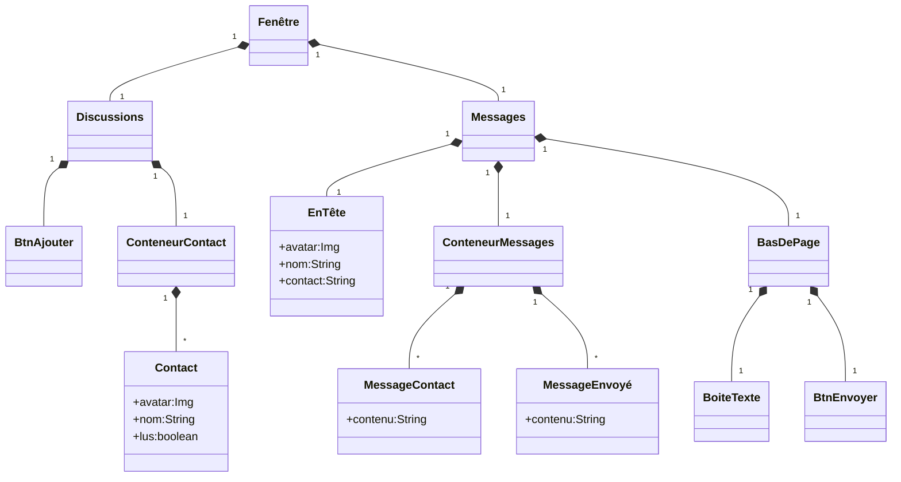

------------------------------------------------

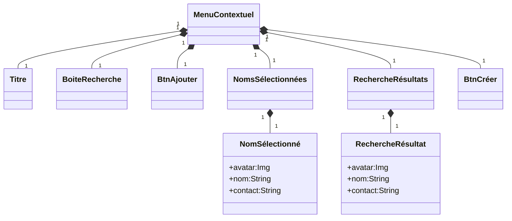

### Diagramme de classe du client VB

Nous sommes rapidement tombés sur une architecture orienté objet pour le client de ce projet et avec raison. Quatres concepts principaux ont émergés : 

1. Chaque formulaire VB devait être un objet (évidemment).
2. La représentation de l'état de la messagerie par des classes telles que des clients et des conversations s'est avérée très utile.
3. La création des certaines classes pour représenter des éléments visuels à stocker pour mieux les manipuler s'est avéré crucial.
4. Nous avons créé une classe qui joue un rôle central dans l'application : une classe de communication avec le serveur.

```mermaid
classDiagram

    FrmConnection "1"o--"1" Communication
    FrmConnection "1"*--"1" FrmInscription
    FrmConnection "1"*--"1" FrmMessagerie
    FrmInscription "1"o--"1" Communication
    FrmMessagerie "1"o--"1" Communication
    FrmMessagerie "1"*--"*" BoîteMessage
    FrmMessagerie "1"*--"*" BoîteConversation
    BoîteMessage "1"o--"1" Message
    BoîteConversation "1"o--"1" Conversation
    FrmMessagerie "1"*--"1" FrmCréerConversation
    FrmCréerConversation "1"*--"*" BoîteChoixContact
    FrmCréerConversation "1"*--"*" BoîteContactChoisis
    BoîteChoixContact "1"o--"1" Contact
    BoîteChoixChoisis "1"o--"1" Contact
    Communication "1"--"1" Utilitaire
    FrmInscription "1"--"1" Utilitaire
    FrmMessagerie "1"--"1" Utilitaire
    
    État "1"*--"*" Contact
    État "1"*--"*" Conversation
    Conversation "*"o--"*" Contact
    Conversation "1"*--"*" Message
    Contact "1"o--"*" Message

    class FrmConnection{
        -communication:Communication

        +New()
        +FrmConnexion_Load()
        -btnConnection_Click()
        -btnInscription_Click()
        -btnQuitter_Click()
    }

    class FrmInscription{
        -communication:Communication

        +New(com:Communication)
        +FrmInscription_Load()
        -FrmInscription_Load()
        -btnEnregistrer_Click()
        -btnRetour_Click()
    }

    note for FrmMessagerie "Se met à jour à toutes les 5 secondes à l'aide du BackgroundWorker"
    class FrmMessagerie{
        -communication:Communication
        -boîteConversations:Dictionary<int:BoîteConversation>
        -conversationActive:int
        -travailleurMiseÀJour:BackgroundWorker

        +New(com:Communication)
        +détruire()
        +BtnEnvoyer_Click()
        +miseÀJour()
        -Form1_Load()
        -déconnection()
        -afficherConversation(conv:Conversation)
        -MessageEntrée_Enter()
        -MessagerEntrée_Leave()
        -MessageEntrée_KeyDown()
        -BtnDéconnection_Click()
        -BtnAjouterConversation()
    }

    class FrmCréerConversation{
        -communication:Communication
        -conversationCréerCallback:Action<Conversation>
        -choixContacts:Dictionary<String:BoîteChoixContact>
        -choixContactsChoisis:Dictionary<String:BoîteChoixContacts>
        -contactsChoisis:Dictionary<String:BoîteContactsChoisis>
        -contactsChoisisRetirés:Dictionary<String:BoîteContactsChoisis>

        +New(com:Communication)
        -Form1_Load()
        -ajouteContact(contact:Contact)
        -retirerContact(contact:Contact)
        -BtnCréer_Click()
    }

    note for Communication "est responsable de la communication HTTP avec le serveur"
    class Communication{
        -clientHttp:HttpClient
        -authorizationHeader:Headers.AuthenticationHeaderValue
        -jeton:String

        +Inscrire(nom_id:String,serveur:String,nom_affichage:String,mot_de_passe:String):Boolean
        +Connecter(nom_id:String,serveur:String,mot_de_passe:String):String
        +Synchronisation_Connection():Communication.SynchronisationConnectionRéponse
        +synchronisation():Communication.SynchronisationRéponse
        +créer_conversation(contactIds:String[*]):int
        +envoyer_message(message:String,conversation_id:int)
        +déconnecter()
    }

    class Contact{
        +nom_id:String
        +serveur:String
        +nom_affichage:String
    }

    class Message{
        +contenu:String
        +date_publication:DateTime
        +contact:Contact
    }

    class Conversation{
        +ID:int
        +contacts:Contact[*]
        +messages:Message[*]
        +est_lue:bool
    }
    
    note for État "Module global"
    class État{
        +contacts:Dictionary<String:Contact>
        +conversation:Dictionary<int:Conversation>
        +session:String
    }

    class Utilitaires{
        +est_identifiant_valide(identifiant:String):bool
    }

    note for BoîteMessage "Contient un message dans la discussion"
    note for BoîteConversation "Bouton de sélection des conversations"
    note for BoîteChoixContact "Contact à choisir lors de la création d'une converation"
    note for BoîteContactChoisis "Contact choisi lors de la création d'une conversation"
    namespace GUI{

        class BoîteMessage{
            +Conteneur:FlowLayoutPanel
            -police_ids:Font
            -police_date:Font

            +New(m:Message)
        }

        class BoîteConversation{
            +Conteneur:FlowLayoutPanel
            -Conversation:Conversation
            -Avatar:PictureBox
            -NomAffichage:Label
            -Lus:RadioButton
            -BtnOuvrir:Button
            -ouvrir_conversation_callbacks:Action<Conversation>[*]

            +New(conv:Conversation)
            +enregistrer_ouvrir_conversation_callback(callback:Action<Conversation>)
            +distribuer_ouvrir_conversation_callback()
            +Activer()
            +Désactiver()
        }

        class BoîteChoixContact{
            +conteneur:FlowLayoutPanel
            +afficher:bool
            -contact:Contact
            -clicCallback:Action<Contact>

            +New(c:Contact,action:Action<Contact>)
            -distribuerClicCallback()
        }

        class BoîteContactChoisis{
            +conteneur:FlowLayoutPanel
            +afficher:bool
            -contact:Contact
            -clicCallback:Action<Contact>

            +New(c:Contact,action:Action<Contact>)
            -distribuerClicCallback()
        }
    }
```

### Conception Base de Donnée

Nous avons fini avec 8 tableaux dans la base de donnée. Évidement nous avions besoin d'un tableau pour les Utilisateurs et leurs messages, mais aussi pour leur conversations et tous les liens multiples à multiples que cela créée. De plus poour permettre de se souvenir d'une invitation à une nouvelle discussion et de messages envoyés mais pas encore lus, nous avons créé deux tables pour les accomoder. Curieusement cependant, il se trouve que la table Contacts soit plus centrale que la table Utilisateur. Ceci s'explique bien par le fait qu'elle inclu les utilisateurs des autres serveurs, ce qui la rend nécessaire pour représenter les conversations qui pourraient très bien mélanger des utilisateurs de différentes origines. Finalement la table ServeursAutorisés sert à authentifier les communications avec des serveurs externes et permet aux administrateurs de limiter les contacts avec l'extérieur par mesure de sécurité.

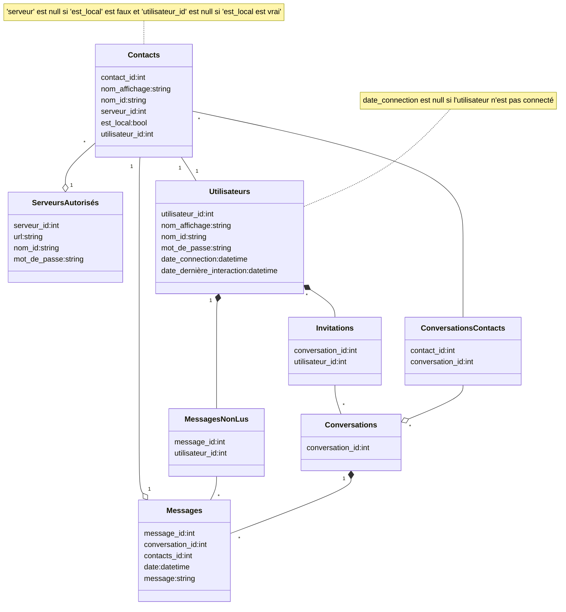

### Noeuds HTTP

Nous avons aussi pris la peine de détailler la liste des noeuds pouvant être atteints par le client, ce qui détaille bien les fonctionnalités de l'application.

- **Inscription :** `POST`, `/inscription`

  ```json
  {
    "nom_id":"<nom_id>",
    "nom_affichage":"<nom_affichage>",
    "mot_de_passe":"<mot_de_passe>"
  }
  ```
  
  - **Réponse :**

    ```json
    {
        "accepté":[true,false]
    }
    ```

- **Connection :** `GET`,`/connection`,`Authorization: Basic <bases64(nom_id:mot_de_passe)>`
  - **Réponse :**
  
    ```json
    {
        "accepté":[true,false],
        // Si "accepté"=true : 
        "jeton":"base64(nom_id:mot_de_passe:date_unix)"
    }
    ```

- **Déconnection :** `POST`, `/deconnection`, `Authorization: Bearer <jeton>`

- **Synchronisation de connection :** `GET`,`/synchronisation-connection`,`Authorization: Bearer <jeton>`
  - **Réponse :**

    ```json
    {
        "contacts":[
            {
                "ID":"<identificateur>",
                "nom":"<nom>"
            }
        ],
        "conversations":[
            {
                "ID":"<int>",
                "contacts":[/*IDs*/],
                "messages":[
                    // En ordre chronologique
                    {
                        "contact":"<identificateur>",
                        "date":"<date>",
                        "message":"<contenu>"
                    }
                ]
            }
        ],
        "conversations-non-lues":[/*IDs*/]
    }
    ```

- **Synchronisation :** `POST`,`/synchronisation`,`Authorization: Bearer <jeton>`
  
  ```json
  {
    "conversations-lues":[/*IDs*/],
    "conversations-effacées":[/*IDs*/]
  }
  ```
  
  - **Réponse :**

    ```json
    {
        "nouvelles-conversations":[
            {
                "ID":"<int>",
                "contacts":[/*IDs*/],
            }
        ],
        "nouveaux-messages":[
            {
                "conversation":"<id>",
                "contact":"<id>",
                "date":"<date>",
                "message":"<contenu>"
            }
        ]
    }
    ```

- **Nouvelle Conversation :** `POST`, `/conversation`, `Authorization: Bearer <jeton>`
  - *Envoie une invitation aux contacts*

  ```json
  {
    "contacts":[/*IDs*/]
  }
  ```

  - **Réponse :**

    ```json
    {
        "accepté":[true,false], // Rejeté si la conversation existe déjà avec les contacts
        "conversation":"<id>", // Date de création UNIX
    }
    ```

- **Invitation :** `POST`, `/invitation`, `Authorization: Bearer <jeton>`

    ```json
    {
        "conversation":"<id>", // Date de création UNIX de la conversation
        "contacts":[/*IDs*/]
    }
    ```

    - **Réponse :**

        ```json
        {"accepté":[true,false]} // Refusé si la conversation existe déjà
        ```

- **Invitation (Inter-serveurs) :** `POST`, `/invitation-relais`, `Authorization: Basic base64(nom:mdp:id_requête)`

    ```json
    {
        "conversation":"<id>", // Date de création UNIX de la conversation
        "contacts":[/*IDs*/],
        "messages":[
            {
                "contact":"<id>",
                "date":"<date>",
                "message":"<contenu>"
            }
        ]
    }
    ```

    - **Réponse :**
  
        ```json
        {"accepté":[true,false]} // Refusé si la conversation existe déjà
        ```

- **Nouveau message :** `POST`, `/message`, `Authorization: Bearer <jeton>`

    ```json
    {
        "conversation":"<id>",
        "message":"<contenu>"
    }
    ```

- **Nouveau message (inter-serveur) :** `POST`, `/message-relais`, `Authorization: Basic base64(nom:mdp:id_requête)`

    ```json
    {
        "conversation":"<id>",
        "contact":"<id>",
        "date":"<date>",
        "message":"<contenu>"
    }
    ```

- **Confirmation d'authentification serveur :** `GET`, `/authentification-serveur`, `Authorization: Basic <jeton envoyé>`
  - *Envoyé après une communication inter-serveur où le serveur veut confirmer l'identité de la source.*
  - **Réponse :**

    ```json
    {
        "jeton":"<jeton envoyé>"
    }
    ```

## Discussion

Nous n'avons malheureusement pas pus implémenter toutes les fonctionalités que nous aurions voulus. Voici donc une liste de choses qui pourraient être améliorées dans l'application : 

- Le support pour les avatar est préparé un peu partout, mais nous n'avons pas eu le temps de nous attarder à leur implémentation.
- La recherche de contacts lors de la création d'une conversation avait été planifié, mais a dû être coupé.
- Bien que bien des mesures de préventions des failles de sécurités ont été prises pour sécuriser l'application un minimum, elle demeure très vulnérable à toute un éventail d'attaques. Par exemple : si la communication ne se fait pas sur HTTPS, les mots de passes sont échangés, seulement caché derrière un encodage Base64, ce qui est aisément décodable : autrement dit nous communiquons les mots de passes en clair.
- Il manque d'outils administrateurs pour gérer le serveur. Une interface graphique serait le bienvenue.
- Nous avons au départ sous-estimé l'ampleur que prendrait le serveur, c'est pourquoi nous avons décidé d'utiliser python pour son développement, mais avec du recul il aurait potentiellement été préférable d'utiliser un langage plus structuré vus la taille que ce dernier a prise.
- Les tests unitaires sont inexistants et nous auraient probablement économisés bien des soucis lors de l'intégration entre le client et le serveur.

## Conclusion

Ce projet nous a été d'un apprentissage phénoménal. Tant en développement de la compréhension des structures réseau qu'en apprentissage faces aux erreurs que nous avons faites dans notre coordination et notre communication. Nous croyons pouvoir poursuivre notre carrière avec une base bien ancrée dans le domaine, ce qui fait de ce projet une réussite à nos yeux.