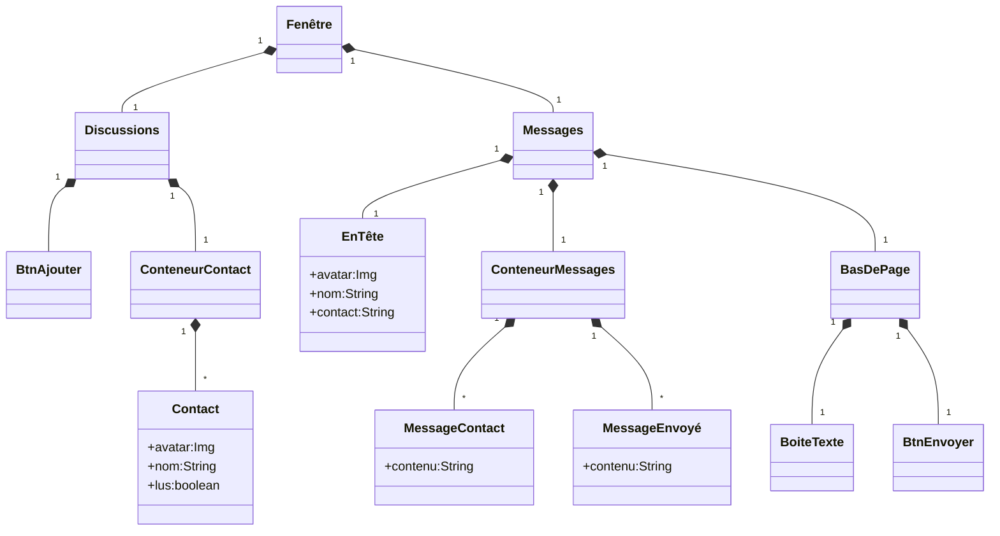
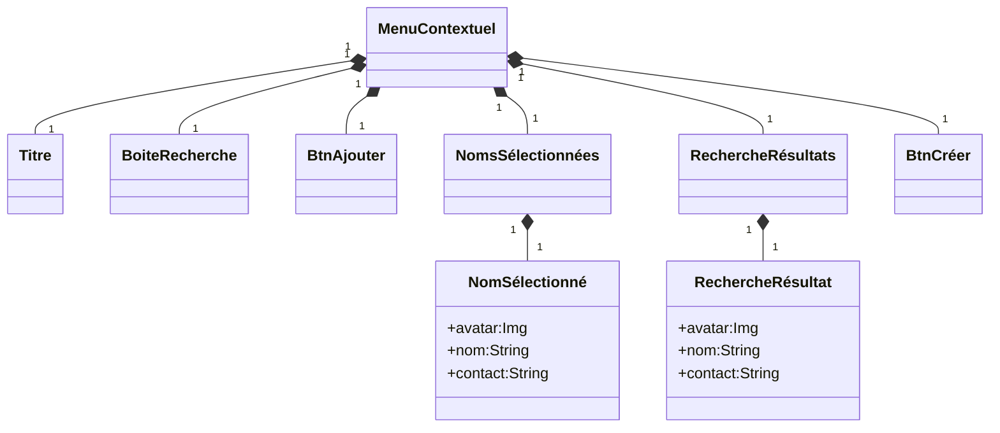

# Messagery

Application de messagerie interne client-serveur en Visual Basic pour le cours de Développement d'Application en Visual Basic.

## Maquette


## Fonctionnalités

- Se connecter à un compte stocké sur un serveur
- Créer une ou plusieurs discussions à un ou plusieurs contacts sur un ou plusieurs serveurs
- Rechercher des contacts sur les serveurs configurés par l'administrateur
- Sélectionner une discussion parmis celles créées
- Voir le fil de discussion
- Envoyer et recevoir des messages
- Mettre à jour la pastille « Messages nons lus ».

## Architecture

### Utilisation et réseau


### Architecture de l'aplication

```text
                          Messages
  Fenêtre     /--Contact ╱    EnTête
 ╱  Discussions   BtnAjouter ╱    MessagesContact
┏━━╱━━━━━━━╱━━━━━╱━━━━╱━━━━━╱━━━━╱━━━━━━━━━━━━━━┓
┃┌╱───────╱─────╱─┐ ╒╱═════╱════╱═════════════╤╕┃
┃| Discus╱ions [+]| || O Nom id@serveur.tld   ||┃
┃|      ╱         | |└────────╱───────────────┘|┃
┃| [o Nom     o ] | |[Message]                /---- MessagesEnvoyés
┃| [o Nom       ] | |[Message]               ╱ |┃
┃| [o Nom     o ] | |                 [Message]|┃
┃| [o Nom        ]| |[Message]                 |┃
┃| [o Nom       ] | |┌────────────────────────┐|┃
┃|                | ||[Message_txt________][>]||┃
┃└────────────────┘ ╘╧╲════════════════════╲═╲╧╛┃
┗━━━━━━━━━━━━━━━━━━━━━━╲━━━━━━━━━━━━━━━━━━━━╲━╲━┛
                        ╲                    ╲ \-- BtnEnvoyer
                         \-- BasDePage        \-- BoiteTexte

                   
                  ConteneurContacts
┏━━━━━━━━━━━━━━━━╱━━━━━━━━━━━━━━━━━━━━━━━━━━━━━━┓
┃┌──────────────╱─┐ ╒╤════════════════════════╤╕┃
┃| Discussions ╱+]| || O Nom id@serveur.tld   ||┃
┃|+--------------+| |└────────────────────────┘|┃
┃||[o Nom     o ]|| |[Message]----------------+|┃
┃||[o Nom       ]|| |[Message]                |---- ConteneurMessages
┃||[o Nom     o ]|| ||                [Message]|┃
┃||[o Nom        ]| |[Message]----------------+|┃
┃||[o Nom       ]|| |┌────────────────────────┐|┃
┃|+--------------+| ||[Message_txt________][>]||┃
┃└────────────────┘ ╘╧════════════════════════╧╛┃
┗━━━━━━━━━━━━━━━━━━━━━━━━━━━━━━━━━━━━━━━━━━━━━━━┛

                             MenuContextuel
                            ╱ Titre
                           ╱ ╱  BoiteRecherche
                          ╱ ╱  ╱          BtnAjouter
   ┏━━━━━━━━━━━━━━━━━━━━━╱━╱━━╱━━━━━━━━━━╱━━━━━━━━━┓
   ┃┌────────────────┐ ╒╱═╱══╱══════════╱════════╤╕┃
   ┃| Discussions [-]| ╱|╱O ╱om id@serv╱ur.tld   ||┃
   ┃|                ┏━━╱━━╱━━━━━━━━━━╱──────────┘|┃
   ┃| [o Nom     o ] ┃ Cré╱r nvl. dis╱┃▒          |┃
   ┃| [o Nom       ] ┃ [id_txt___][+] ┃▒          |┃
   ┃| [o Nom     o ] ┃[[o Nom][o Nom]]-------------- NomsSélectionnés
   ┃| [o Nom        ]┃┌──────────────\-------------- NomSélectionné
   ┃| [o Nom       ] ┃|[o Nom a@a.a ]|┃▒─────────┐|┃
   ┃|                ┃|[o Nom a@a.a ]|┃▒_____][>]||┃
   ┃└────────────────┃└─╱────────────┘┃▒═════════╧╛┃
   ┗━━━━━━━━━━━━━━━━━┃ ╱ [ Créer> ]   ╲▒━━━━━━━━━━━┛
                     ┗╱━━━━━━━━━━━╲━━━┛\--- RechercheRésultats
RechercheRésultat ---/ ▒▒▒▒▒▒▒▒▒▒▒▒╲▒▒▒▒  
                                    \--- BtnCréer                     
```

### Hiérarchie des composantes



----------------------------------------------

