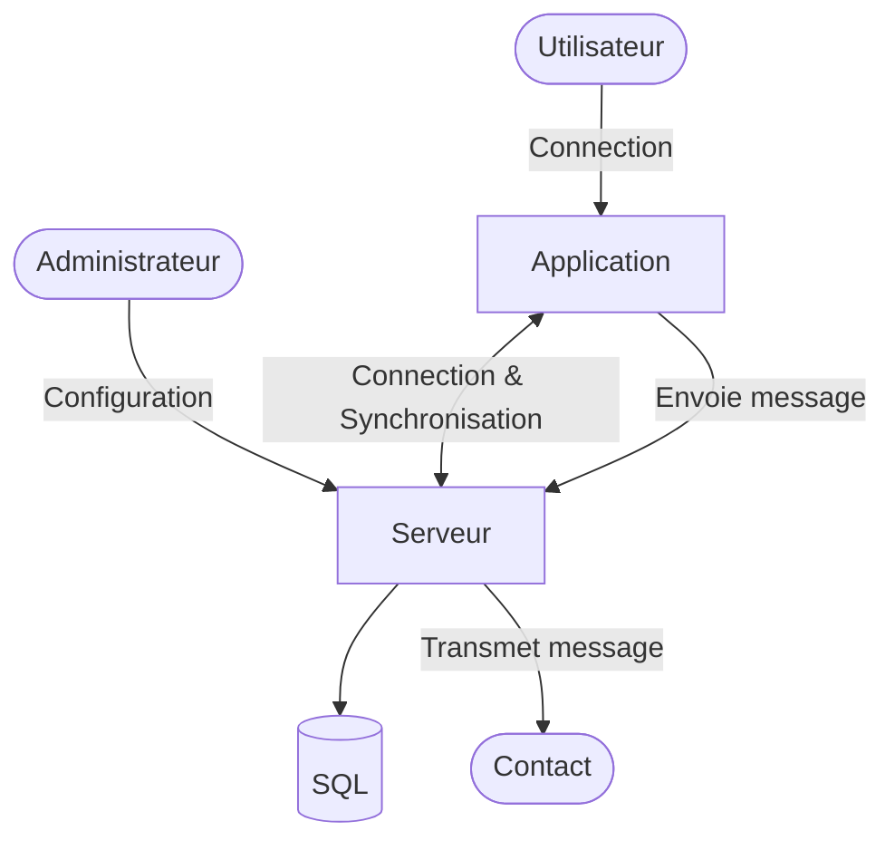
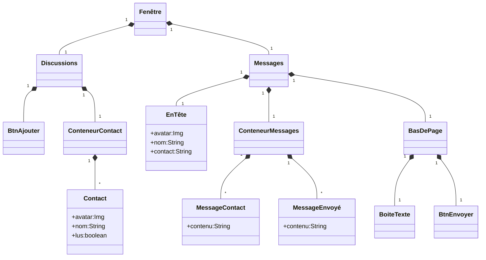
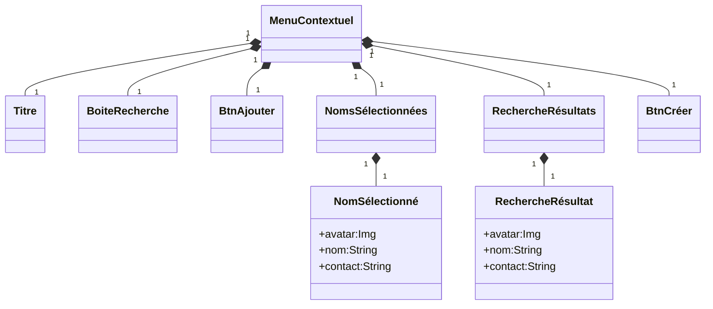
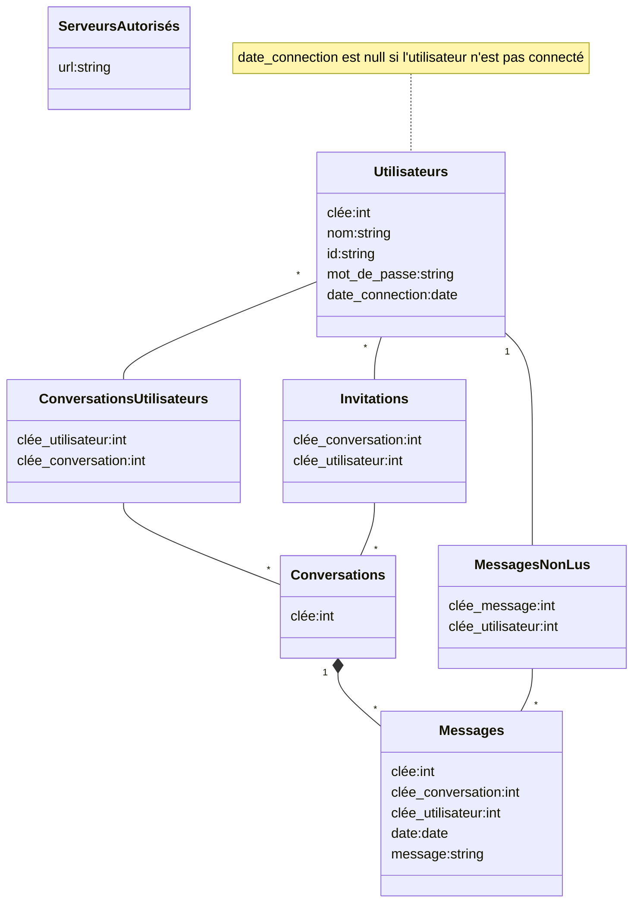

# Messagery

Application de messagerie interne client-serveur en Visual Basic pour le cours de Développement d'Application en Visual Basic.

## Maquette


## Fonctionnalités

- Se connecter à un compte stocké sur un serveur
- Créer une ou plusieurs discussions à un ou plusieurs contacts sur un ou plusieurs serveurs
- Rechercher des contacts sur les serveurs configurés par l'administrateur
- Sélectionner une discussion parmis celles créées
- Voir le fil de discussion
- Envoyer et recevoir des messages
- Mettre à jour la pastille « Messages nons lus ».

## Architecture

### Utilisation et réseau



### Architecture de l'aplication

```text
                          Messages
  Fenêtre     /--Contact ╱    EnTête
 ╱  Discussions   BtnAjouter ╱    MessagesContact
┏━━╱━━━━━━━╱━━━━━╱━━━━╱━━━━━╱━━━━╱━━━━━━━━━━━━━━┓
┃┌╱───────╱─────╱─┐ ╒╱═════╱════╱═════════════╤╕┃
┃| Discus╱ions [+]| || O Nom id@serveur.tld   ||┃
┃|      ╱         | |└────────╱───────────────┘|┃
┃| [o Nom     o ] | |[Message]                /---- MessagesEnvoyés
┃| [o Nom       ] | |[Message]               ╱ |┃
┃| [o Nom     o ] | |                 [Message]|┃
┃| [o Nom        ]| |[Message]                 |┃
┃| [o Nom       ] | |┌────────────────────────┐|┃
┃|                | ||[Message_txt________][>]||┃
┃└────────────────┘ ╘╧╲════════════════════╲═╲╧╛┃
┗━━━━━━━━━━━━━━━━━━━━━━╲━━━━━━━━━━━━━━━━━━━━╲━╲━┛
                        ╲                    ╲ \-- BtnEnvoyer
                         \-- BasDePage        \-- BoiteTexte

                   
                  ConteneurContacts
┏━━━━━━━━━━━━━━━━╱━━━━━━━━━━━━━━━━━━━━━━━━━━━━━━┓
┃┌──────────────╱─┐ ╒╤════════════════════════╤╕┃
┃| Discussions ╱+]| || O Nom id@serveur.tld   ||┃
┃|+--------------+| |└────────────────────────┘|┃
┃||[o Nom     o ]|| |[Message]----------------+|┃
┃||[o Nom       ]|| |[Message]                |---- ConteneurMessages
┃||[o Nom     o ]|| ||                [Message]|┃
┃||[o Nom        ]| |[Message]----------------+|┃
┃||[o Nom       ]|| |┌────────────────────────┐|┃
┃|+--------------+| ||[Message_txt________][>]||┃
┃└────────────────┘ ╘╧════════════════════════╧╛┃
┗━━━━━━━━━━━━━━━━━━━━━━━━━━━━━━━━━━━━━━━━━━━━━━━┛

                             MenuContextuel
                            ╱ Titre
                           ╱ ╱  BoiteRecherche
                          ╱ ╱  ╱          BtnAjouter
   ┏━━━━━━━━━━━━━━━━━━━━━╱━╱━━╱━━━━━━━━━━╱━━━━━━━━━┓
   ┃┌────────────────┐ ╒╱═╱══╱══════════╱════════╤╕┃
   ┃| Discussions [-]| ╱|╱O ╱om id@serv╱ur.tld   ||┃
   ┃|                ┏━━╱━━╱━━━━━━━━━━╱──────────┘|┃
   ┃| [o Nom     o ] ┃ Cré╱r nvl. dis╱┃▒          |┃
   ┃| [o Nom       ] ┃ [id_txt___][+] ┃▒          |┃
   ┃| [o Nom     o ] ┃[[o Nom][o Nom]]-------------- NomsSélectionnés
   ┃| [o Nom        ]┃┌──────────────\-------------- NomSélectionné
   ┃| [o Nom       ] ┃|[o Nom a@a.a ]|┃▒─────────┐|┃
   ┃|                ┃|[o Nom a@a.a ]|┃▒_____][>]||┃
   ┃└────────────────┃└─╱────────────┘┃▒═════════╧╛┃
   ┗━━━━━━━━━━━━━━━━━┃ ╱ [ Créer> ]   ╲▒━━━━━━━━━━━┛
                     ┗╱━━━━━━━━━━━╲━━━┛\--- RechercheRésultats
RechercheRésultat ---/ ▒▒▒▒▒▒▒▒▒▒▒▒╲▒▒▒▒  
                                    \--- BtnCréer                     
```

### Hiérarchie des composantes



------------------------------------------------



### Conception Base de Donnée



### Noeuds HTTP

- **Connection :** `GET`,`/connection`,`Authorisation: Basic <bases64(nom_d'utilisateur:mot_de_passe)>`
  - **Réponse :**
  
    ```json
    {
        "accepté":[true,false],
        // Si "accepté"=true : 
        "jeton":"base64(nom_d'utilisateur:mot_de_passe:date_unix)"
    }
    ```

- **Déconnection :** `PUT`, `/deconnection`, `Authorisation: Bearer <jeton>`

- **Synchronisation de connection :** `GET`,`/synchronisation-connection`,`Authorisation: Bearer <jeton>`
  - **Réponse :**

    ```json
    {
        "contacts":[
            {
                "ID":"<identificateur>",
                "nom":"<nom>"
            }
        ],
        "conversations":[
            {
                "ID":"<int>",
                "contacts":[/*IDs*/],
                "messages":[
                    // En ordre chronologique
                    {
                        "contact":"<identificateur>",
                        "date":"<date>",
                        "message":"<contenu>"
                    }
                ]
            }
        ],
        "conversations-non-lues":[/*IDs*/]
    }
    ```

- **Synchronisation :** `GET`,`/synchronisation`,`Authorisation: Bearer <jeton>`
  
  ```json
  {
    "conversations-lues":[/*IDs*/],
    "nouvelles-conversations":[/*IDs*/],
    "conversations-effacées":[/*IDs*/]
  }
  ```
  
  - **Réponse :**

    ```json
    {
        "nouvelles-conversations":[
            {
                "ID":"<int>",
                "contacts":[/*IDs*/],
            }
        ],
        "nouveaux-messages":[
            {
                "conversation":"<id>",
                "contact":"<id>",
                "date":"<date>",
                "message":"<contenu>"
            }
        ]
    }
    ```

- **Nouvelle Conversation :** `PUT`, `/conversation`, `Authorisation: Bearer <jeton>`
  - *Envoie une invitation aux contacts*
  - **Réponse :**

    ```json
    {
        "accepté":[true,false], // Rejeté si la conversation existe déjà avec les contacts
        // Si "accepté"=true : 
        "contacts":[/*IDs*/]
    }
    ```

- **Invitation :** `PUT`, `/invitation`, `Authorisation: Bearer <jeton>`

    ```json
    {
        "conversation":"<id>",
        "contacts":[/*IDs*/]
    }
    ```

- **Invitation (Inter-serveurs) :** `PUT`, `/invitation-relais`

    ```json
    {
        "conversation":"<id>",
        "contacts":[/*IDs*/],
        "messages":[
            {
                "contact":"<id>",
                "date":"<date>",
                "message":"<contenu>"
            }
        ]
    }
    ```

- **Nouveau message :** `PUT`, `/message`, `Authorisation: Bearer <jeton>`

    ```json
    {
        "conversation":"<id>",
        "message":"<contenu>"
    }
    ```

- **Nouveau message (inter-serveur) :** `PUT`, `/message-relais`

    ```json
    {
        "conversation":"<id>",
        "contact":"<id>",
        "date":"<date>",
        "message":"<contenu>"
    }
    ```